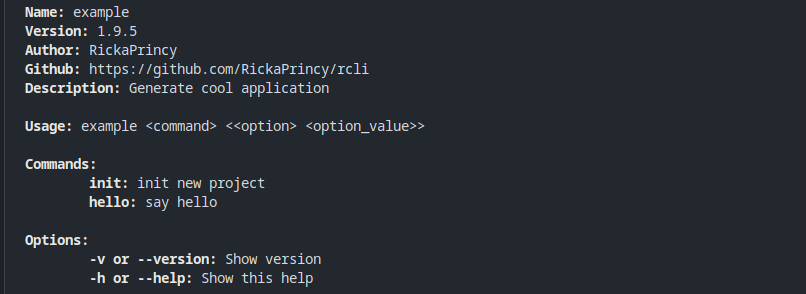
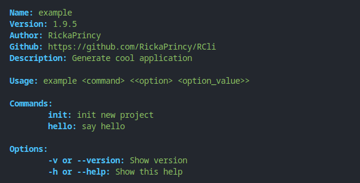
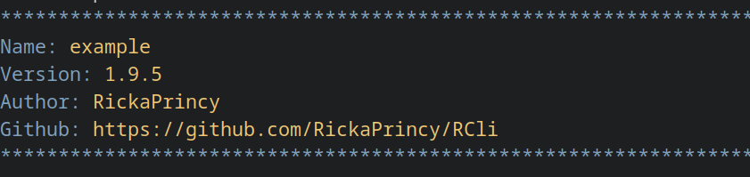
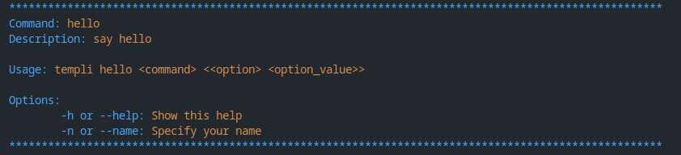
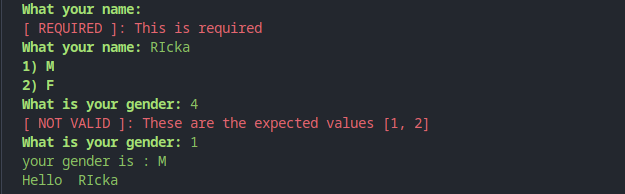

# rcli :wrench:

rcli is a powerful C++ library that simplifies the creation of CLI applications. It provides convenient user `input functions` and efficiently manages command-line `options` and `subcommands`. 

With rcli, you can effortlessly handle user interactions, process input, and implement features like help commands (your_cli -h).

For the color, rcli use [TColor](http://github.com/RickaPrincy/TColor)

# BUILD :hammer:

- Dependancies
    - CMake (Version 3.27 or later)
    - C++ Compiler with C++17 support

- Run the configure_and_build.sh script to build rcli.

# Gettting started

### Step 1: Include rcli in your Project

Include the rcli library in your project by adding the following include statements at the beginning of your source file:

```cpp
#include <rcli/rcli.hpp>
#include <iostream>
```

### Step 2: Create and Configure Your CLI Application

Create an instance of the App class, specifying the application name, version, and a brief description.

```cpp
int main(int argc, const char *argv[]){
    Config::_error_color = TColor::B_RED; // rcli use TColor
    App example("example", "1.9.5", "cool application");
    // ...
    // (Your application logic will be added in the following steps)
    example.run(argc, argv);
    return 0;
}
```
### Step 3: Define Commands and Options

Define commands and options within your application. For example, you can create an "init" command and a "hello" command. Specify options for user input, such as the file name and user's name:

```cpp
Command init("init", "Initialize a new project", [](Command* _init){
    std::cout << "File value: " << _init->get_option_value("file") << std::endl;
});

init.add_option(Option("-f,--file", "Specify file name", "file"));

Command hello("hello", "Say hello", [&](Command* _hello){
    String name = _hello->get_option_value("name");
    if (name.empty()) {
        // If name is not provided as an option, ask the user for input
        name = ask_input_value("What is your name");
    }
    std::cout << "Hello, " << name << "!" << std::endl;
});

hello.add_option("-n,--name", "Specify your name", "name");
```

### Step 4: Run Your CLI Application

Add the commands to your App object, and run your CLI application by calling the run method:

```cpp
templi.add_subcommand(init);
templi.add_subcommand(hello);
templi.run(argc, argv);
```

# Another features 

### Automatically Added Options :bulb:

rcli automatically adds help options `(-h and --help)` to all commands, and version options `(-v and --version)` to the main App object. Users can use these options to get information about your application.

### Use Various Input Types in rcli :jack_o_lantern:

rcli provides various input types:

```cpp
#ifndef __RCLI_INPUTS__
#define __RCLI_INPUTS__
    #include <rcli/types.hpp>

    namespace rcli {

        // one simple value
        String ask_input_value(InputConfig config);

        // multiples values
        VectorString ask_inputs_values(std::vector<InputConfig> configs);

        // ask the value in list without showing the list
        String ask_value_in_list(InputConfig config, VectorString options, bool ignore_case = false);

        // ask single one boolean
        bool ask_boolean(String text, bool default_value = true);

        // ask in value list of options
        String ask_value_in_options(String text, VectorString options);

    } // namespace rcli

#endif
```

# Default color



# Customized_color



# Some output







# If you wanna install rcli

```bash
yay -Sy rcli #For system based on archlinux
```
or 

```bash
bash <(curl -s https://raw.githubusercontent.com/RickaPrincy/rcli/main/install.sh)
```
 
# License 

This project is licensed under the [MIT License](License.txt).